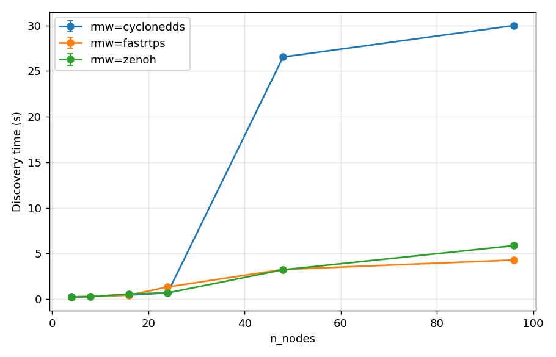
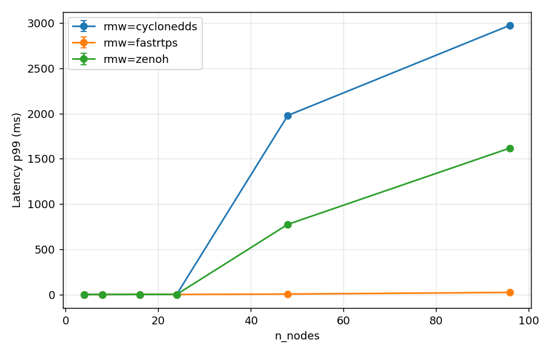
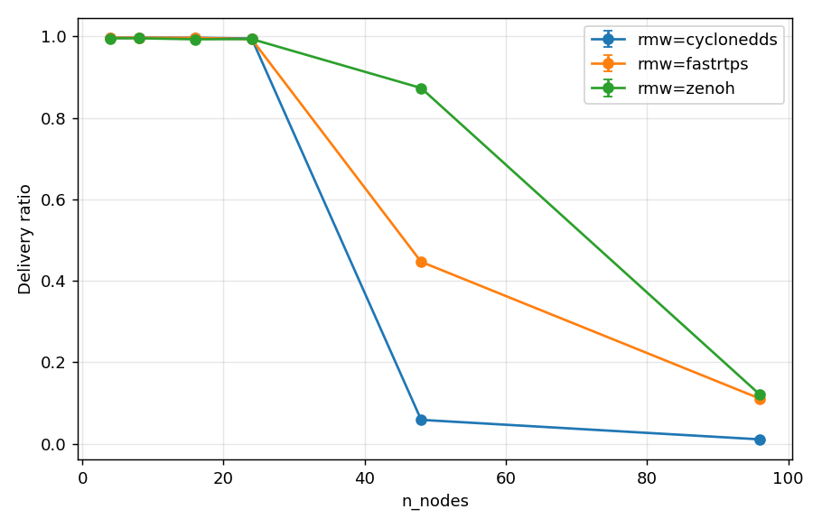

# DDS / RMW scaling: Fast DDS vs Cyclone vs Zenoh on a swarm bridge

Motivation: every prior result here is a *resilience-under-jamming* study on the
AF_PACKET channel substrate. This one is different — a pure **middleware
performance** study with **no EW vector**. The question is purely: how do the
three ROS 2 RMWs scale as the swarm grows, and where does each one's discovery /
delivery break down? (Plan: `docs/dds-benchmark-plan.md`.)

## Setup

A new **`bridge`** substrate (`substrate: bridge`): one netns + veth per drone,
every host veth enslaved to a single Linux kernel bridge that does L2
forwarding. No RF model, no forwarder, no mobility — the kernel carries the
traffic, which is the fair, standard baseline for a DDS benchmark (a clean
switched segment). Multicast floods to every port (`mcast_snooping 0`) so each
RMW uses its **native discovery**. SHM is forced off so traffic is real UDP over
the veth, per-node isolated (no same-host shared-memory shortcut). Identical
QoS / period / payload across RMWs.

- **RMW axis:** `rmw_fastrtps_cpp` 8.4.3 (Fast DDS), `rmw_cyclonedds_cpp` 2.2.3
  (Cyclone), `rmw_zenoh_cpp` 0.2.9 (Zenoh). ROS 2 Jazzy (robostack `ros-base`
  0.11.0).
- **Scale sweep:** N = 4 → 8 → 16 → 24 → 48 → 96 drones.
- **Workload:** stock ROS 2 telemetry node (`ros2_workload/node.py`), 5 Hz
  (`period_ms=200`), 255 B payload, reliable QoS, 30 s/run, seed 0.
- **Host:** 24-core, 62 GB RAM (~33 GB free at start, 7.3 GB swap already in use
  by other apps), single machine.
- **Transport isolation:** Fast DDS via `FASTDDS_BUILTIN_TRANSPORTS=UDPv4`;
  Cyclone via a generated `CYCLONEDDS_URI` (SHM off, multicast on, interface
  autodetermine); Zenoh via an explicit lower-index TCP router mesh — see the
  asymmetry note below.

## Result

Per N, per RMW (mean over the run; `mesh` = fraction of ordered (node, peer)
pairs that ever exchanged a message; `delivery` = received / offered):

| N | RMW | discovery (s) | p50 (ms) | p99 (ms) | delivery | mesh | rss/proc (MB) |
|---|---|---|---|---|---|---|---|
| 4  | zenoh      | 0.21 | 1.36 | 1.99 | 0.995 | **1.00** | 64 |
| 4  | fastrtps   | 0.23 | 0.57 | 0.85 | 0.997 | **1.00** | 67 |
| 4  | cyclonedds | 0.24 | 0.52 | 0.82 | 0.997 | **1.00** | 57 |
| 8  | zenoh      | 0.26 | 1.22 | 2.09 | 0.995 | **1.00** | 64 |
| 8  | fastrtps   | 0.27 | 0.56 | 0.96 | 0.997 | **1.00** | 68 |
| 8  | cyclonedds | 0.27 | 0.52 | 1.03 | 0.997 | **1.00** | 57 |
| 16 | zenoh      | 0.56 | 1.13 | 2.08 | 0.993 | **1.00** | 66 |
| 16 | fastrtps   | 0.43 | 0.61 | 1.79 | 0.996 | **1.00** | 70 |
| 16 | cyclonedds | 0.44 | 0.53 | 2.05 | 0.997 | **1.00** | 59 |
| 24 | zenoh      | 0.66 | 0.93 | 2.37 | 0.993 | **1.00** | 69 |
| 24 | fastrtps   | 1.32 | 0.58 | 2.13 | 0.993 | **1.00** | 73 |
| 24 | cyclonedds | 0.67 | 0.51 | 2.22 | 0.995 | **1.00** | 61 |
| **48** | zenoh      | 3.21 | 9.99  | 776  | **0.873** | **0.918** | 84 |
| **48** | fastrtps   | 3.24 | 1.27  | 6.47 | 0.447 | 0.453 | 79 |
| **48** | cyclonedds | 26.53 | 1.56 | 1979 | 0.059 | 0.198 | 67 |
| **96** | zenoh      | 5.86 | 13.42 | 1619 | 0.120 | 0.130 | 91 |
| **96** | fastrtps   | 4.28 | 7.48  | 24.6 | 0.111 | 0.112 | 89 |
| **96** | cyclonedds | 29.99 | 664  | 2975 | 0.011 | 0.054 | 75 |

Curves: 


(also `dds-curve-latency-p50-ms.png`, `dds-curve-rss-peak-mb.png`)

## Headline: a sharp knee at N = 48

**Through N = 24 all three RMWs are healthy** — full mesh, ≥99 % delivery,
sub-1.4 s discovery, single-digit-ms p99. **At N = 48 the mesh collapses**, and
by N = 96 none of the three forms a usable mesh within the 30 s window. The
*order* of collapse is the differentiator:

- **Zenoh degrades most gracefully** — still 92 % mesh / 87 % delivery at N = 48
  (vs 45 % / 20 % for the DDS pair). By 96 it too is down to ~13 %.
- **Cyclone collapses hardest and earliest** — 20 % mesh at 48, 5 % at 96, with
  pathological tail latency (p99 ≈ 2 s) and p50 blowing up to 664 ms at 96.
- **Fast DDS sits in between** and keeps the tightest tail latency of the DDS
  pair (p99 24.6 ms at 96 vs Cyclone's ~3 s), but still only 11 % delivery.

## This is real RMW degradation, not a saturated test rig

The single most important control for a single-host benchmark: was the *host*
the bottleneck? **No.** Host-pressure counters sampled during every run
(`resources.parquet` + manifest):

| N | peak host mem used | min host mem free | swap | per-proc RSS | all procs exit 0 |
|---|---|---|---|---|---|
| 24 | 29.1 GB | 33.1 GB | 7.3 GB (flat) | ~70 MB | yes |
| 48 | 31.1 GB | 31.1 GB | 7.3 GB (flat) | ~84 MB | yes |
| 96 | 33.1 GB | **29.1 GB** | 7.3 GB (flat) | ~91 MB | yes |

Even at N = 96 — where Zenoh runs **192 processes** (a router + a node per
netns) — the host still had **29 GB free**, swap never grew beyond the 7.3 GB
already held by unrelated apps, per-proc CPU peaked at ~36 %, and every process
exited cleanly. Memory grew only ~4 GB from N = 24 to N = 96. The kernel bridge,
96 netns, and 96–192 processes were never the limit. **The collapse is in the
middleware discovery / endpoint-matching path**, exactly where a swarm-scale DDS
benchmark is supposed to find it: the N² SPDP/EDP multicast storm (Fast DDS,
Cyclone) and the pub/sub matching across a 96-router mesh (Zenoh) do not
converge in time, while the machine sits ~half idle.

## Caveats (read before citing)

1. **30 s window.** Part of the N ≥ 48 collapse is discovery not *completing*
   within the run, not discovery being impossible — Cyclone's 26 s discovery at
   N = 48 means some pairs *do* eventually connect, very slowly. The honest
   claim is about the **scaling trend** (discovery time exploding super-linearly
   while the host stays idle), not a hard "fails forever" at 48. A
   longer-duration follow-up at 48/96 would separate "slow" from "broken" — see
   future work.
2. **Zenoh discovery is not directly comparable (plan Q1).** Fast DDS and Cyclone
   are routerless and discover peers via native multicast; `rmw_zenohd` routers
   do **not** autoconnect to peer routers off multicast scouting in this build
   (they hear each other on 224.0.0.224 but stay unconnected; the
   autoconnect/whatami override key is rejected). So Zenoh uses a **pre-wired
   explicit TCP router mesh** — its "discovery time" is effectively
   session/topic-matching time, not peer discovery. Its **delivery and mesh**
   numbers *are* comparable, and the fact that it holds better at N = 48 is a
   real, meaningful result. This asymmetry is architectural, documented, not a
   bug.
3. Single host, single seed, one payload/rate point. This is the scaling-curve
   shape, not an exhaustive QoS sweep.

## Reproduce

```bash
# generate the per-N bridge scenarios + sweeps (already committed under scenarios/dds/)
python -m netcom_zen.harness.dds_scenarios
# run the RMW x N sweep (serial, needs root for netns/bridge)
sudo .pixi/envs/ros2/bin/python -m netcom_zen.harness.sweep scenarios/dds/sweep_n<N>.yaml -o results/dds/n<N>
#   ... for N in 4 8 16 24 48 96
# aggregate the scaling curves + table across all N
sudo .pixi/envs/default/bin/python -m netcom_zen.harness.dds_report results/dds
```

## Status / future work

- **Rosbag realism cross-check** (`harness/rosbag.py`): not yet run — a single
  confirmatory replay of one real telemetry stream through each RMW at N = 4,
  to confirm the synthetic 5 Hz pattern is representative. Documented, manual,
  Phase-C optional.
- **Longer-duration 48/96 runs** to separate "discovery slow" from "discovery
  fails" (caveat 1).
- The `tc netem` hook on the bridge is stubbed (no-op) for optional controlled
  loss/latency later — not used in this study.
