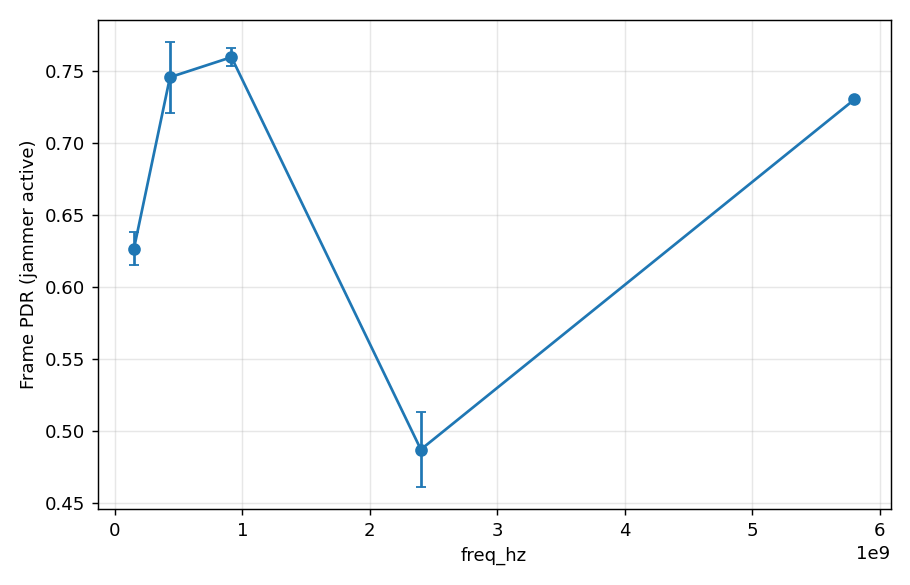
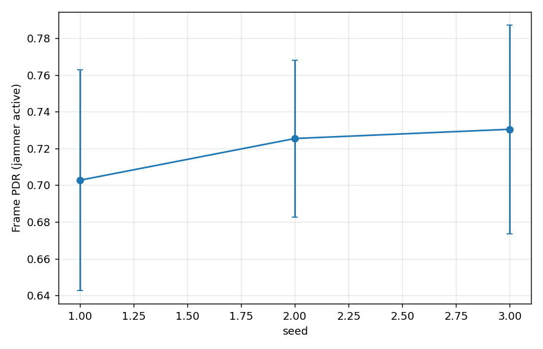

# Carrier band trades connectivity for agility — and the swarm's crypto is the first casualty

M5.1 ([plan](../m5-plan.md)): sweep the carrier across a tactical/ISM ladder —
150 MHz (VHF), 433 MHz, 915 MHz (UHF ISM), 2.4 GHz, 5.8 GHz — on the
`resilience_4node` geometry (three vehicles in the open, v4 beyond a 100 m
forest strip; a 12.5 MHz barrage jammer *inside* the strip from t=20 s, 50 dBm).
Everything else held fixed: EIRP (27 dBm), antenna gain, noise figure, per-hop
channel 250 kHz, data rate 250 kbps, hop 100/s, no FEC. Two variants isolate
the two effects that carrier choice couples:

- **V1 — fixed channelization** (50 × 250 kHz = 12.5 MHz span at every band):
  the barrage always covers the whole span (`ρ = 1`), so band differences are
  pure **propagation** — both the signal's and the jammer's.
- **V2 — fixed fractional bandwidth** (span/carrier held at the 433 MHz
  baseline 2.89 %, `n_channels` zipped with the carrier: 17 → 670): the fixed
  12.5 MHz barrage covers 100 % of the span at ≤ 433 MHz but only 7.5 % at
  5.8 GHz — band differences add **spectral agility** on top of propagation.
  (`sweep.py zip_axes`; barrage `ρ` is the geometric overlap
  `min(1, B_j/span)`, [models.md](../models.md).)

3 seeds per cell, 60 s runs, full engine (netns + agents + MLS).

## V1 — propagation only (frame-level PDR, mean over seeds)

| band | PDR quiet | PDR jammed | dominant drops | app delivery |
|---|---|---|---|---|
| 150 MHz | 1.000 | **0.626** | jam | 0.369 |
| 433 MHz | 1.000 | 0.745 | jam | 0.386 |
| 915 MHz | 1.000 | **0.759** | jam | 0.401 |
| 2.4 GHz | 0.842 | 0.487 | jam ≈ foliage | **0 — MLS never forms** |
| 5.8 GHz | 0.680 | 0.730¹ | foliage | **0 — MLS never forms** |

¹ survivorship, not recovery: at 5.8 GHz the cross-forest links are already
dead *before* the jammer (foliage), so the jammed-phase average is computed
over the surviving short open-field links only.

Two propagation effects, pulling opposite ways:

- **Foliage climbs with carrier** (Weissberger ≈ f^0.284: ~16 dB across the
  100 m strip at 433 MHz, ~33 dB at 5.8 GHz): quiet PDR degrades 1.00 → 0.68
  as the forest-edge links (anything involving v4) leave the link budget.
  The open-field baseline barely moves — beyond the two-ray crossover the
  ground-reflection loss is frequency-independent, so *range* alone is not
  what high bands lose here; **obstructions are**.
- **The jammer propagates too**: at 150 MHz its emissions shrug off the strip
  it sits in and reach every receiver — jammed PDR is *worst* at the lowest
  band (0.63) and best at 915 MHz (0.76). Low band's long legs help the
  adversary exactly as much as the swarm.

**The swarm's group crypto is the first casualty.** At 2.4/5.8 GHz zenoh's
transport still limps through the marginal foliage link (`peers_ready` fires
on every node), but the MLS handshake — which needs *every* member — never
completes within its 30 s deadline, so **no node ever publishes**: application
delivery is zero while frame PDR still reads 0.68–0.84. The band choice
surfaces as a security-layer outage before it surfaces as packet loss, the
same weak-link failure mode the EMANE spike flagged
([backlog](../ew-track-backlog.md)); the
[hardened handshake](mls-handshake-hardening.md) widened the loss regime the
group survives, but a link that delivers ~0.1 of frames for 30 s straight is
beyond retry discipline — it needs either more link budget or a relay
([routing-comparison](routing-comparison.md)).

## V2 — fractional bandwidth held: agility joins the fight

| band | n_ch (span) | barrage ρ | PDR jammed V1 → V2 | app delivery V1 → V2 | mean AoI V1 → V2 |
|---|---|---|---|---|---|
| 150 MHz | 17 (4.25 MHz) | 1.0 | 0.63 → 0.63 | 0.37 → 0.38 | 12.0 → 11.9 |
| 433 MHz | 50 (12.5 MHz) | 1.0 | 0.745 → 0.745 | 0.39 → 0.39 | 10.8 → 10.8 |
| 915 MHz | 106 (26.5 MHz) | 0.47 | 0.76 → 0.76¹ | **0.40 → 0.47** | **10.7 → 8.5** |
| 2.4 GHz | 277 (69 MHz) | 0.18 | **0.49 → 0.74** | 0 → 0 (MLS) | — |
| 5.8 GHz | 670 (167.5 MHz) | 0.075 | 0.73 → 0.73 | 0 → 0 (MLS) | — |

(433 MHz is configuration-identical in both variants and reproduces exactly —
the built-in consistency check. Analytic expectation at k = 1 dwell/packet:
jam-limited survival ≈ `1 − ρ`.)

Where the agility lands, by band:

- **2.4 GHz** shows it at frame level, dramatically: jammed PDR 0.49 → 0.74,
  and the drop mix flips from `jam ≈ foliage` (448 vs 445) to foliage-dominated
  (540 vs **104**) — the barrage now covers 18 % of the span and hopping simply
  outruns it in frequency space. But app delivery is still **zero**: agility
  cannot fix the quiet-phase foliage link that blocks MLS formation.
- **915 MHz** shows it where it matters: aggregate jammed frame PDR is flat¹,
  but app-level update delivery climbs **+17 %** (0.40 → 0.47) and mean AoI
  falls **−21 %** (10.7 → 8.5 s). The links the barrage used to kill outright
  now deliver ~53 % of frames, so zenoh keeps their sessions alive and state
  actually crosses them.
- **≤ 433 MHz**: the fixed 12.5 MHz barrage still covers the whole (smaller)
  span — no agility to be had; identical to V1.

¹ frame PDR misleads here the same way it did in the
[TCP-vs-UDP result](transport-tcp-vs-udp.md): V2 *attempts* ~50 % more frames
on the formerly-dead links (jam drop count rises 1025 → 1536 while per-link
survival improves 0 → 0.53), so the aggregate ratio barely moves while the
application gets strictly more state through. Judge bands by update delivery
and AoI, not frame PDR.

## Verdict per threat regime

- **Quiet, obstructed terrain:** low band wins outright — 150/433 MHz keep
  every link including the forest edge; at 2.4 GHz+ the group doesn't even
  form. If the swarm must operate through vegetation, carrier beats every
  other knob in this study.
- **Under wideband jamming:** the middle wins. 915 MHz is the sweet spot:
  still enough foliage margin to keep the swarm whole (MLS forms, delivery
  0.47 — the best app-level number in the whole study), and enough
  fractional-bandwidth agility that the fixed barrage covers under half its
  span (+17 % delivery, −21 % AoI over fixed channelization). Pushing to
  2.4/5.8 GHz buys more agility (jam drops −77 % at 2.4 GHz) than the jammer
  story needs and loses the swarm to foliage first.
- **Design coupling:** the usable lever is not "higher carrier" but **wider
  hop span at a carrier the terrain permits** — the agility gain is a
  channelization property (V2 − V1 at the same band), while the propagation
  cost is what actually climbing the ladder charges. If hardware allows a
  26 MHz span at 915 MHz, that beats moving to 2.4 GHz for a wider one.

## Caveats

- Equal-EIRP / equal-NF comparison isolates propagation + channelization;
  real front-ends couple antenna aperture and noise bandwidth to carrier.
- No terrain relief in this scenario (`terrain_db = 0`): the propagation story
  is foliage-driven; knife-edge diffraction would further favour low band.
- `k = 1` dwell per packet at 100 hop/s: the FHSS dilution acts per-packet
  (`survival = 1 − ρ`); faster hopping + FEC would compose with band agility
  per the [FEC-flip result](fec-flips-hop-rate.md).
