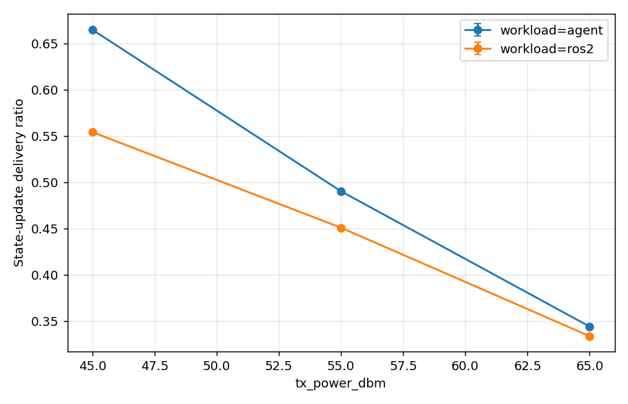
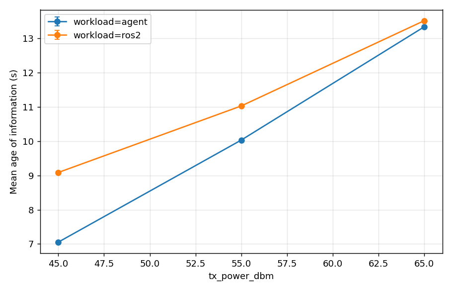

# R3 A/B: purpose-built agent vs stock ROS 2 (rmw_zenoh) under jamming

**Date:** 2026-06-13 · **Sweep:** `scenarios/sweep_ros2_vs_agent.yaml`
(barrage jammer power × workload, paired seeds, 60 s runs, 4 vehicles,
forest strip) · **Reproduce:**

```
pixi run -e ros2 bash -c 'sudo $(which python) -m netcom_zen.harness.sweep \
    scenarios/sweep_ros2_vs_agent.yaml -o results/ros2-vs-agent'
pixi run -e ros2 bash -c 'sudo $(which python) -m netcom_zen.harness.report \
    results/ros2-vs-agent --x jammers.0.tx_power_dbm --series workload'
```

## Contenders

| | crosses the channel | reliability | security |
|---|---|---|---|
| **agent** | Rust agent, zenoh UDP best-effort, state-based CRDT snapshots (the transport+sync A/B champion) | app-layer (snapshots self-heal) | MLS-encrypted |
| **ros2** | stock ROS 2 Jazzy nodes, `rmw_zenoh_cpp`, one zenoh router per netns, TCP mesh over the TUNs, default reliable QoS | TCP + ROS 2 reliable | none |

Matched workload both ways: 255 B state update per vehicle every 500 ms,
all-to-all. Same channel realizations (paired seeds).

## Results (mean over seeds)

| workload | jam dBm | frame PDR (postjam) | update delivery | mean AoI (s) | median delay (ms) |
|---|---|---|---|---|---|
| agent | 45 | 0.62 | **0.67** | **7.1** | **10.1** |
| ros2  | 45 | 0.89 | 0.55 | 9.1 | 12.9 |
| agent | 55 | 0.47 | **0.49** | **10.0** | **10.1** |
| ros2  | 55 | 0.77 | 0.45 | 11.0 | 12.9 |
| agent | 65 | 0.14 | **0.34** | **13.3** | **10.0** |
| ros2  | 65 | 0.37 | 0.33 | 13.5 | 12.9 |




## Reading

- **The agent wins app-level goodput and freshness at every jammer power,
  despite carrying MLS encryption that ROS 2 lacks here**: +20 % update
  delivery and −22 % mean AoI at 45 dBm, converging as the channel dies
  (+3 % / −1 % at 65 dBm — nothing beats a dead channel).
- **The frame-PDR inversion is not a contradiction.** ROS 2's higher frame PDR
  comes from TCP congestion control backing off under loss: fewer, smaller
  frames offered (drop counts confirm: ~90 jam drops vs ~320 for the agent at
  45 dBm), and retransmissions eventually land. Frames that arrive late carry
  stale state — app-level delivery and AoI are the honest metrics, frame PDR
  is workload-dependent.
- This repeats the transport A/B lesson one layer up: reliability-by-
  retransmission converts loss into staleness; reliability-by-snapshot
  (CRDT state sync over best-effort) converts loss into a brief freshness gap.
- **Caveats:** stock ROS 2 ran its default QoS (reliable/keep-last-10);
  best-effort QoS over rmw_zenoh still rides the router-router TCP links, so a
  fair UDP-transport ROS 2 variant would need zenoh UDP links between routers
  — a follow-up axis. Discovery completed pre-jam in all cells (12/12 pairs);
  bringing nodes up *under* jamming would stress rmw_zenoh's discovery and is
  a separate (harsher) scenario.
