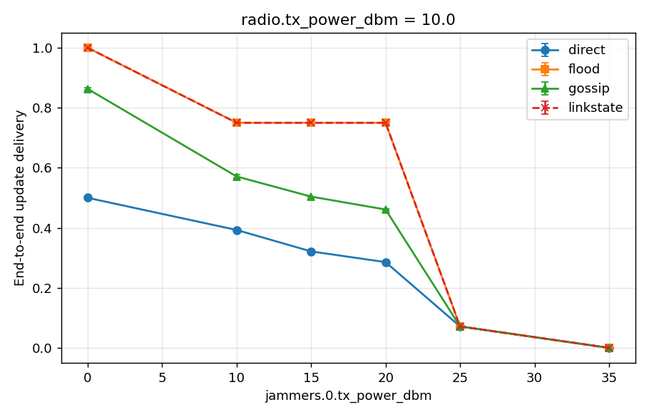

# Multi-hop routing recovers exactly what physics allows — and no more

The engine's delivery model has always been single-hop: a pair with no viable
direct link is simply disconnected. M5.2 asks what multi-hop routing would buy
under our jamming model, **as a model-level comparison** — no MANET daemon, no
protocol; every policy consumes the same per-tick `build_table()` output and is
judged on **paired channel realizations** (one seeded uniform per (tick,
directed link), shared by all policies), so differences are routing, not luck.
See the policy definitions and cost model in
[`netcom_zen/routing.py`](../../sim/netcom_zen/routing.py).

**Setup** (`scenarios/sweep_routing.yaml`, root-free): 8 static nodes in a
2×4 grid, 450 m spacing, 2.4 GHz / 250 kHz FSK. A 12.5 MHz barrage jammer sits
near the *bottom* row, so rising power first deafens the bottom-middle relays
while the top row survives as a detour. Axes: jammer power × radio tx power
(link margin = effective swarm spread) × 3 seeds; updates every 0.5 s; delivery
probabilities at the 200 B reference payload.

## Delivery (mean over seeds; policies at radio tx 10 dBm)

| jam (dBm) | direct | linkstate | flood | gossip(0.6, ttl 4) | regime |
|---|---|---|---|---|---|
| off | 0.50 | **1.00** | **1.00** | 0.86 | far pairs need relays |
| 10 | 0.39 | **0.75** | **0.75** | 0.57 | bottom-middle deaf |
| 15 | 0.31 | **0.75** | **0.75** | 0.50 | ” |
| 20 | 0.28 | **0.75** | **0.75** | 0.46 | ” |
| 25 | 0.07 | 0.07 | 0.07 | 0.07 | network cut |
| 35 | 0.00 | 0.00 | 0.00 | 0.00 | everything deaf |

Three regimes, three verdicts:

1. **Quiet:** the grid's far pairs are beyond direct range, so direct tops out
   at 0.50 (a pure geometry number). Routing delivers **1.00** — multi-hop
   doubles delivery before any adversary shows up.
2. **Moderate jamming (10–20 dBm):** the jammer deafens v2/v3 as *receivers*
   (they can still transmit, but an update that never reaches them can't be
   relayed onward), which removes 14 of 56 directed pairs physically. Routing holds exactly
   **0.75 = 42/56 — every pair that is physically reachable** — by detouring
   over the top row, while direct decays to 0.28. The plateau is the signature:
   routing recovers all of what physics allows and is flat while the allowed
   set doesn't change.
3. **Heavy jamming (25+ dBm):** the jam disc swallows the top row too; only 4
   corner-vertical pairs remain and **every policy collapses to the same
   number**. Routing cannot beat physics — a cut network stays cut.

## Spread (link margin) scales the win

| radio tx | direct (quiet) | routing (quiet) | routing's edge |
|---|---|---|---|
| 5 dBm (sparse: neighbours only) | 0.25 | 0.77 | **3.1×** |
| 10 dBm (+ diagonals) | 0.50 | 1.00 | 2.0× |
| 15 dBm (dense) | 0.76 | 1.00 | 1.3× |

The sparser the connectivity (wider effective spread), the more routing buys —
and at 15 dBm the extra margin also stretches the moderate-jam plateau out to
25 dBm where the 10 dBm grid was already cut.

(At 5 dBm even routing can't reach 1.0 quiet: v2↔v7-class diagonal-only pairs
have no all-up path — 0.77 is again the physics ceiling, not a policy limit.)

## The bandwidth price

| policy | tx per delivered update (tx 10, quiet → jam 20) |
|---|---|
| direct (1 broadcast) | 0.29 → 0.51 |
| linkstate (forwarding tree) | 1.00 |
| flood (epidemic) | 1.14 → 1.19 |
| gossip | 0.75 → 0.87 |

Full-mesh delivery costs ~2–3× direct's per-delivery transmissions. **linkstate
matches flood's delivery everywhere at 14–19 % less cost** — in this
saturated-link regime (per-tick link probabilities are ≈0/1) any existing path
is found by Dijkstra, so epidemic redundancy buys nothing. **gossip(0.6) is
dominated**: less delivery than linkstate *and* worse AoI at comparable cost —
random forwarding coins just drop updates when links are binary.

## Caveats

- Within-tick multi-hop assumes forwarding latency ≪ the 100 ms tick.
- `linkstate` is a centralised upper bound (oracle link-state, zero routing
  overhead); a real distributed protocol pays convergence lag the model skips.
  The result says multi-hop is *worth* a protocol, not that it's free.
- AoI is conditional on pairs that ever received an update; policy AoI numbers
  are comparable to each other, not across delivery ratios.
- This scenario's link probabilities are nearly binary (FSK waterfall at
  200 B), so seed variance is tiny; the interesting stochastic-regime cross
  (mid-probability links) stays open until a scenario sits on the PER cliff.

## Verdict

Multi-hop routing is **worth a real implementation** for this swarm: it doubles
quiet delivery on spread geometries and holds the physics ceiling under
moderate jamming where direct loses another third. A shortest-viable-path
scheme (the agent already shares link state via CRDT — the input is free) gets
all of flood's benefit at ~85 % of its cost; skip gossip. Logged as a candidate
follow-up: `linkstate` forwarding in the Rust agent.
