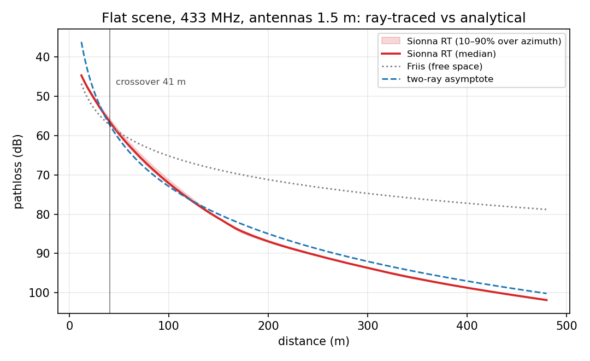
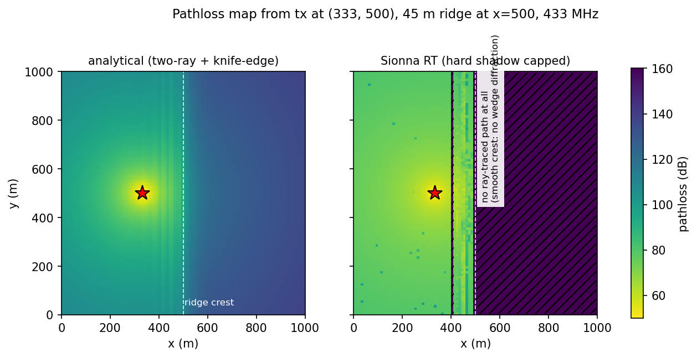

# Sionna RT vs analytical pathloss (M5.3)

**Question.** What does a ray-traced propagation backend (Sionna RT) buy over
the analytical composite (Friis/two-ray + knife-edge + Weissberger) — and
where does it mislead?

**Setup.** The scenario terrain is meshed (lossy ground, εr 15 / σ 0.005 S/m,
the classic ITU-R P.527 "medium dry ground") and Sionna RT's deterministic
`PathSolver` coherently sums LoS + specular reflections + wedge diffraction
per (tx, rx) pair at antenna height 1.5 m — precomputed offline on GPU into a
7×7 tx-grid × 100×100 rx-cell pathloss grid (~80 s per scene on an RTX 5090),
then served at runtime by a pure-numpy interpolating provider
(`environment.pathloss: sionna`). Foliage stays analytical Weissberger in
both backends. Grids: `grids/resilience_4node_433.npz` (flat) and
`grids/sionna_hill_433.npz` (45 m Gaussian ridge, `scenarios/sionna_hill_4node.yaml`),
both at 433 MHz. Assertions live in `validation/test_sionna_vs_analytical.py`.

A Monte-Carlo `RadioMapSolver` was tried first and rejected: with both link
ends at 1.5 m the geometry is grazing, and ray *launching* both misses the
ground-bounce interference (−12 dB vs two-ray at 150 m) and runs out of hits
beyond ~300 m (57% of cells never reached). The deterministic path solver has
neither problem.

## Where they must agree, they do (pipeline validation)

Flat scene, all 10,000 cells reachable, far-field (beyond the 41 m two-ray
crossover) over 300 random pairs:

| metric | value |
|---|---|
| median \|RT − two-ray\| | **1.7 dB** |
| p90 \|RT − two-ray\| | 2.0 dB |

The residual is physics, not error: RT reflects off finite-permittivity
ground (\|Γ\| < 1, Brewster-angle behaviour for vertical polarization) where
the two-ray asymptote assumes a perfect mirror. Before the crossover RT
oscillates around Friis exactly as the textbook says.

## Divergence 1 — smooth terrain casts *hard* shadows in RT

Cross-ridge links on the hill scene:

| pair (m) | knife-edge excess | RT excess |
|---|---|---|
| (300,400) → (700,400) | 30.2 dB | **no path at all** (≥153 dB) |
| (350,600) → (650,600) | 31.1 dB | no path |
| (200,500) → (800,500) | 28.4 dB | no path |

Root cause, isolated by a wedge-sharpness scan: sionna-rt (2.0.1) generates
diffracted paths only around *sharp* wedges — a triangular ridge needs
slopes ≥ ~56° (interior dihedral ≲ 90°, i.e. building-corner geometry)
before any diffracted field appears. Real terrain crests (20–45° slopes)
produce **zero** diffracted energy, an infinite shadow where the analytical
knife-edge model keeps the physically sensible finite ~25–30 dB loss.
Geometric optics + UTD simply does not model creeping-wave diffraction over
smooth obstacles.

**Consequence:** for terrain-dominated scenarios the *analytical* model is
closer to reality. `pathloss: sionna` should be used on flat/open scenes
(where it is strictly more faithful), not as a terrain-shadowing upgrade.

## Divergence 2 — terrain redirects energy the analytical model can't see

Same-side (unblocked) links on the hill scene read systematically *below*
the flat-earth baseline: median RT − baseline = **−17 dB** (p90 |·| 23 dB)
over 200 random west-side pairs. Per-path inspection shows why: the
west-facing ridge slope is a huge tilted reflector whose echo (delay +250 ns
and up) dominates once the direct + ground-bounce pair nearly cancels in the
deep two-ray regime — the ridge *fills the two-ray nulls* and creates an
interference-fringe field. The grid is faithful to the tracer (≤0.2 dB at
exact tx-node/cell pairs); the fringes themselves are ~10 m-scale structure
that the 10 m rx-cell / 167 m tx-node grid necessarily smooths. This is
added fidelity for connectivity (links the analytical model writes off as
deep-null dead are alive), at the cost of position-scale accuracy no grid
this coarse can carry.

## End-to-end engine run

`scenarios/sionna_4node.yaml` = resilience_4node (433 MHz, foliage strip,
barrage jammer at t=20 s, agent workload) with `pathloss: sionna` — same
geometry, jammer, seed. Single paired run:

| metric | composite | sionna |
|---|---|---|
| frame PDR pre-jam | 1.000 | 1.000 |
| frame PDR post-jam | 0.787 | 0.785 |
| forest link (v4) post-jam | 0.067 | 0.124 |
| open links post-jam | 0.947 | 0.952 |
| MLS group formed | 4/4 agents | 4/4 agents |
| CRDT updates recv/pub | 779 / 480 | 761 / 482 |

On this flat + foliage scenario the two backends agree on every headline
number — which is the point: the analytical model stands vindicated where
its assumptions hold, and swapping `pathloss:` is a one-line change when
they don't. The only visible shift is the marginal forest link, where the
RT ground interaction moves a threshold-straddling SINR by a few dB
(post-jam PDR 0.07 → 0.12) without changing any conclusion.

## Caveats

- Equal-comparison scope: iso antennas, V polarization, single ground
  material; no buildings, no vehicles-as-reflectors (same class of caveat as
  the analytical model's).
- The grid is per-frequency (the provider refuses a >1% carrier mismatch) —
  band sweeps need one precompute per band.
- Coherent per-cell values: the grid stores the deterministic fringe field
  sampled at cell centres, not a local fading statistic. Fine for defensible
  aggregate curves (fringes decorrelate across links/ticks); do not read
  single-link small-scale accuracy into it.
- Precompute granularity: 7×7 tx nodes / 10 m rx cells; symmetrised lookup
  halves the tx-interpolation error, but fringed regions retain O(10 dB)
  point error (see Divergence 2).
